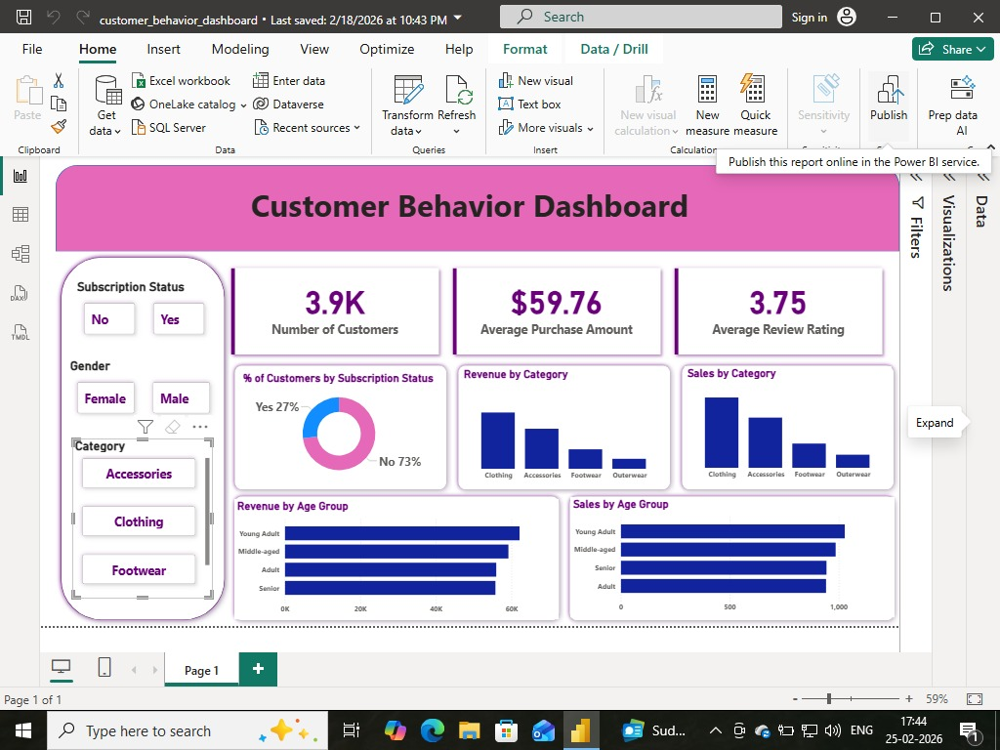

# 📊 Customer Behavior Analysis Dashboard

An interactive **Power BI dashboard project** that analyzes customer
shopping behavior to generate actionable business insights.
This project helps businesses understand purchasing trends, subscription
impact, revenue distribution, and customer segmentation.

------------------------------------------------------------------------

## 📌 Project Overview

Understanding customer behavior is critical for improving marketing
strategies, increasing revenue, and optimizing product categories.

This project analyzes:

-   Customer demographics
-   Purchase patterns
-   Revenue distribution by category
-   Subscription impact
-   Age-group based sales trends
-   Customer review ratings

-------------------------------------------------------------------------

## 📷 Dashboard Preview

  

------------------------------------------------------------------------

## 🎯 Business Objectives

-   Identify high-revenue product categories
-   Analyze customer segmentation (Age, Gender, Subscription)
-   Evaluate subscription influence on revenue
-   Measure average purchase amount
-   Analyze customer satisfaction using review ratings
-   Provide actionable recommendations

------------------------------------------------------------------------

## 🛠️ Tech Stack

  Tool               Purpose
  ------------------ --------------------------------
  Power BI           Dashboard & Data Visualization
  SQL                Data Cleaning & Transformation
  Excel / CSV        Data Source
  DAX                KPI Calculations
  Jupyter Notebook   Exploratory Data Analysis

------------------------------------------------------------------------

## 📂 Project Structure

Customer-Behavior-Analysis/ │ ├── customer_shopping_behavior.csv ├──
customer_behavior_analysis_cleaned.sql ├──
Customer_shopping_behaviour_analysis.ipynb ├── dashboard_screenshot.png
└── README.md

------------------------------------------------------------------------

## 📊 Key Dashboard KPIs

-   👥 3.9K Total Customers
-   💰 \$59.76 Average Purchase Amount
-   ⭐ 3.75 Average Review Rating
-   📈 Revenue by Category
-   📊 Sales by Age Group
-   📌 Subscription Status Distribution

------------------------------------------------------------------------

## 📈 Dashboard Insights

### 1️⃣ Subscription Analysis

-   73% customers are non-subscribers
-   27% are subscribers

💡 Opportunity: Increase subscription conversion campaigns

### 2️⃣ Revenue by Category

-   Clothing generates highest revenue
-   Accessories second highest
-   Outerwear lowest revenue contributor

💡 Focus marketing on high-performing categories

### 3️⃣ Revenue by Age Group

-   Young Adults are the highest contributors
-   Seniors contribute the least

💡 Targeted campaigns for high-value age groups

### 4️⃣ Customer Satisfaction

-   Average rating: 3.75
-   Indicates scope for product/service improvement

------------------------------------------------------------------------

## 🔎 Data Preparation Steps

-   Removed null values
-   Standardized category names
-   Corrected inconsistent formats
-   Created calculated columns
-   Built DAX measures for KPIs

------------------------------------------------------------------------

## 🧮 Sample DAX Measures

Total Customers = COUNT(Customer\[Customer ID\])

Average Purchase Amount = AVERAGE(Customer\[Purchase Amount])

Average Rating = AVERAGE(Customer\[Review Rating])

------------------------------------------------------------------------

## 🚀 How to Run This Project

1.  Clone the repository
2.  Open Power BI Desktop
3.  Load the CSV dataset
4.  Apply transformations (if required)
5.  Open the .pbix dashboard file
6.  Interact with filters and visuals

------------------------------------------------------------------------

## 📌 Business Recommendations

-   Launch subscription marketing campaigns
-   Provide discounts on low-performing categories
-   Improve product quality to boost ratings
-   Target Young Adults with personalized promotions
-   Introduce loyalty programs

------------------------------------------------------------------------

## 💼 Why This Project Matters

This project demonstrates:

-   Data cleaning & transformation skills
-   Business intelligence understanding
-   Dashboard development expertise
-   Analytical thinking
-   Insight generation for decision-making

------------------------------------------------------------------------
